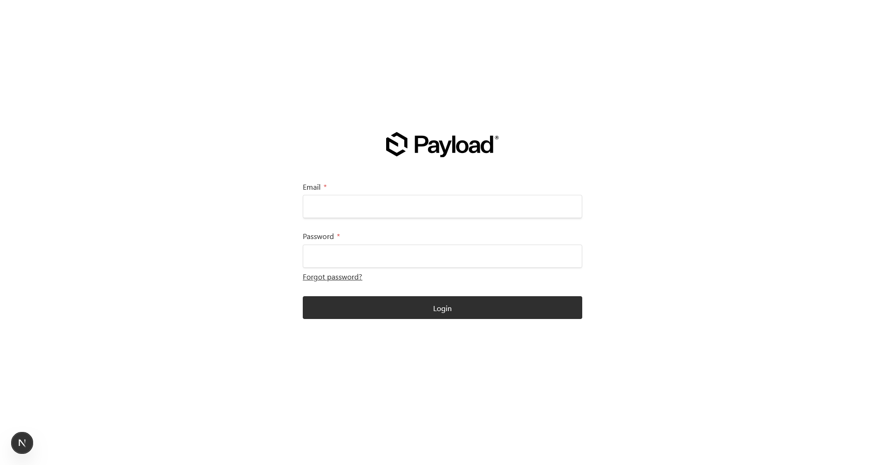

# Payload CMS 3.0 + Next.js 16 + Turso + Cloudflare R2

[](https://payloadcms.com)
[](https://nextjs.org)
[](https://www.typescriptlang.org)
[](https://turso.tech)
[](https://www.cloudflare.com/products/r2/)
[](LICENSE)

Plantilla completa de Payload CMS 3.0 con Next.js 16, base de datos Turso (SQLite) y almacenamiento en Cloudflare R2.

> ** ¿Primera vez?** Lee la [Guía Rápida de Inicio (5 minutos)](./docs/QUICKSTART.md)

---

## Documentación

- **[ QUICKSTART.md](./docs/QUICKSTART.md)** - Inicio rápido en 5 minutos
- **[ DEVELOPMENT.md](./docs/DEVELOPMENT.md)** - Guía de desarrollo y extensión
- **[ COMMANDS.md](./docs/COMMANDS.md)** - Referencia completa de comandos
- **[ ARCHITECTURE.md](./docs/ARCHITECTURE.md)** - Arquitectura técnica con diagramas
- **[ CI_CD.md](./docs/CI_CD.md)** - GitHub Actions, Dependabot y automatizaciones
- **[ DOCKER.md](./docs/DOCKER.md)** - Docker, deployment y contenedores
- **[ CONTRIBUTING.md](./docs/CONTRIBUTING.md)** - Guía para contribuir al proyecto

## Tabla de Contenidos

- [Características](#-características)
- [Vista Actual del Proyecto](#-vista-actual-del-proyecto)
- [Requisitos Previos](#-requisitos-previos)
- [Instalación](#-instalación)
- [Configuración de Variables de Entorno](#-configuración-de-variables-de-entorno)
  - [1. Turso Database](#1-turso-database)
  - [2. Cloudflare R2](#2-cloudflare-r2)
  - [3. Payload Secret](#3-payload-secret)
  - [4. Correo (SMTP o Resend - opcional)](#4-correo-smtp-o-resend---opcional)
- [Comandos Disponibles](#-comandos-disponibles)
- [Estructura del Proyecto](#-estructura-del-proyecto)
- [Despliegue](#-despliegue)
- [Solución de Problemas](#-solución-de-problemas)
  - [Versiones de Payload desajustadas](#versiones-de-payload-desajustadas)
- [Aprender Más](#-aprender-más)

## Características

### Stack Principal

| Tecnología         | Versión | Propósito                                           |
| ------------------ | ------- | --------------------------------------------------- |
| **Payload CMS**    | 3.69.0  | Sistema de gestión de contenidos moderno y headless |
| **Next.js**        | 16.2    | Framework React con App Router y SSR                |
| **Turso Database** | Latest  | Base de datos SQLite distribuida y serverless       |
| **Cloudflare R2**  | Latest  | Almacenamiento de archivos compatible con S3        |
| **TypeScript**     | 5.9.3   | Tipado estático completo en todo el proyecto        |
| **Drizzle ORM**    | 0.31.10 | ORM type-safe para migraciones                      |
| **GraphQL**        | 16.13.1 | Capa GraphQL para Payload API                       |

### Características Destacadas

- ** Admin Panel Moderno** - Interfaz intuitiva y personalizable
- ** Lexical Editor** - Editor de texto rico con formato avanzado
- ** Autenticación JWT** - Sistema seguro de usuarios integrado
- ** API REST + GraphQL** - Endpoints automáticos para tu contenido
- ** Storage en la Nube** - Archivos en Cloudflare R2 (compatible S3)
- ** Base de Datos Serverless** - Turso con edge locations globales
- ** Testing Completo** - Vitest (integración) + Playwright (E2E)
- ** Docker Ready** - Multi-stage optimizado + GHCR (producción)
- ** Documentación Completa** - Guías paso a paso en carpeta `/docs`
- ** Type-Safe** - TypeScript en todo el stack
- ** CI/CD Integrado** - GitHub Actions + Auto-format
- ** Auto-Deploy** - Imagen Docker publicada automáticamente desde `main`

## Vista Actual del Proyecto

Captura del estado actual del panel de administración de Payload:



## Requisitos Previos

- **Node.js**: >= 20.9.0 (recomendado 20.x LTS)
- **pnpm**: gestor de paquetes por defecto (recomendado 10.32.1 con Corepack)
- **Cuenta en Turso**: [turso.tech](https://turso.tech)
- **Cuenta en Cloudflare**: [cloudflare.com](https://cloudflare.com)

### Instalar pnpm

```bash
corepack enable
corepack prepare pnpm@10.32.1 --activate
```

Este proyecto usa `pnpm` como gestor por defecto (definido también en `package.json` con `packageManager`).

## Instalación

### 1. Clonar el repositorio

```bash
git clone <tu-repositorio>
cd <nombre-del-directorio-clonado>
```

### 2. Instalar dependencias

```bash
pnpm install
```

## Configuración de Variables de Entorno

Crea un archivo `.env` en la raíz del proyecto con las siguientes variables:

```env
# Payload CMS
PAYLOAD_SECRET=tu_secreto_super_seguro_aqui

# Turso Database
TURSO_DATABASE_URL=libsql://tu-base-de-datos.turso.io
TURSO_AUTH_TOKEN=tu_token_de_autenticacion_turso
TURSO_PUSH=false

# Cloudflare R2
R2_BUCKET_NAME=nombre-de-tu-bucket
R2_ACCESS_KEY_ID=tu_access_key_id
R2_SECRET_ACCESS_KEY=tu_secret_access_key
R2_ENDPOINT=https://tu_account_id.r2.cloudflarestorage.com

# Next.js (opcional)
NEXT_PUBLIC_SERVER_URL=http://localhost:3000

# Email (opcional, según adapter)
EMAIL_FROM=no-reply@tu-dominio.com

# Resend (si eliges Resend)
RESEND_API_KEY=re_xxxxxxxxxxxxx

# SMTP (si eliges SMTP)
SMTP_HOST=smtp.tu-proveedor.com
SMTP_PORT=587
SMTP_USER=tu_usuario_smtp
SMTP_PASS=tu_password_smtp
SMTP_SECURE=false
```

### 1. Turso Database

Turso es una base de datos SQLite distribuida y serverless. Necesitas 2 variables:

#### Paso 1: Instalar Turso CLI

```bash
# macOS/Linux
curl -sSfL https://get.tur.so/install.sh | bash

# Windows (PowerShell)
irm get.tur.so/install.ps1 | iex
```

#### Paso 2: Autenticarse

```bash
turso auth login
```

#### Paso 3: Crear la base de datos

```bash
# Crear una nueva base de datos
turso db create mi-proyecto-db

# Listar tus bases de datos
turso db list
```

#### Paso 4: Obtener las credenciales

```bash
# Obtener la URL de la base de datos
turso db show mi-proyecto-db --url
# Copia este valor para TURSO_DATABASE_URL

# Crear un token de autenticación
turso db tokens create mi-proyecto-db
# Copia este valor para TURSO_AUTH_TOKEN
```

**Variables obtenidas:**

- `TURSO_DATABASE_URL`: URL de tu base de datos (ejemplo: `libsql://mi-proyecto-db-usuario.turso.io`)
- `TURSO_AUTH_TOKEN`: Token de autenticación (cadena larga de caracteres)

**Nota sobre TURSO_PUSH:**

- `TURSO_PUSH=false` (desarrollo): Las migraciones se manejan manualmente
- `TURSO_PUSH=true` (producción): Drizzle hace push automático del schema

### 2. Cloudflare R2

Cloudflare R2 es un servicio de almacenamiento de objetos compatible con S3. Necesitas 4 variables:

#### Paso 1: Acceder a Cloudflare Dashboard

1. Ingresa a [dash.cloudflare.com](https://dash.cloudflare.com)
2. Inicia sesión o crea una cuenta

#### Paso 2: Crear un bucket R2

1. En el panel lateral, selecciona **R2**
2. Click en **"Create bucket"**
3. Asigna un nombre (ejemplo: `mi-proyecto-media`)
4. Selecciona la región (recomendado: automática)
5. Click en **"Create bucket"**

**Variable obtenida:**

- `R2_BUCKET_NAME`: El nombre de tu bucket (ejemplo: `mi-proyecto-media`)

#### Paso 3: Obtener el Endpoint

1. Ve a la página de tu bucket
2. En la sección **"Settings"**, busca **"Endpoint"** o **"Public bucket URL"**
3. El formato será: `https://<ACCOUNT_ID>.r2.cloudflarestorage.com`

**Variable obtenida:**

- `R2_ENDPOINT`: URL del endpoint (ejemplo: `https://abc123def456.r2.cloudflarestorage.com`)

#### Paso 4: Crear API Token (Access Keys)

1. En el dashboard de Cloudflare, ve a **R2**
2. Click en **"Manage R2 API Tokens"** (esquina superior derecha)
3. Click en **"Create API token"**
4. Asigna un nombre descriptivo (ejemplo: `mi-proyecto-token`)
5. Permisos:
   - **Object Read & Write** (recomendado)
   - O **Admin Read & Write** (si necesitas control total)
6. Opcionalmente, restringe el token a buckets específicos
7. Click en **"Create API Token"**

**¡IMPORTANTE!** Después de crear el token, verás una pantalla con:

**Variables obtenidas:**

- `R2_ACCESS_KEY_ID`: Access Key ID (ejemplo: `abc123def456ghi789`)
- `R2_SECRET_ACCESS_KEY`: Secret Access Key (cadena más larga y secreta)

** GUARDA ESTAS CREDENCIALES INMEDIATAMENTE** - No podrás volver a ver el Secret Access Key.

### 3. Payload Secret

El `PAYLOAD_SECRET` es una clave secreta para encriptar datos sensibles en Payload CMS.

#### Generar un secreto seguro:

```bash
# Opción 1: OpenSSL (Linux/macOS/Git Bash)
openssl rand -base64 32

# Opción 2: Node.js
node -e "console.log(require('crypto').randomBytes(32).toString('base64'))"

# Opción 3: Generador online
# Visita: https://generate-secret.vercel.app/32
```

**Variable obtenida:**

- `PAYLOAD_SECRET`: Cadena aleatoria de al menos 32 caracteres

### 4. Correo (SMTP o Resend - opcional)

Puedes usar cualquiera de los dos adapters de correo en Payload. Es una decisión de preferencia y necesidades del proyecto.

#### Opción A: Resend

```bash
pnpm add @payloadcms/email-resend resend
```

Configura `RESEND_API_KEY` y `EMAIL_FROM` en tu `.env`.

#### Opción B: SMTP (Nodemailer)

```bash
pnpm add @payloadcms/email-nodemailer nodemailer
```

Configura `SMTP_HOST`, `SMTP_PORT`, `SMTP_USER`, `SMTP_PASS`, `SMTP_SECURE` y `EMAIL_FROM` en tu `.env`.

Ejemplo de integración en `src/payload.config.ts` (elige un adapter):

```ts
// Resend
// import { resendAdapter } from '@payloadcms/email-resend'

// SMTP
// import { nodemailerAdapter } from '@payloadcms/email-nodemailer'

export default buildConfig({
  // ...
  // email: resendAdapter({
  //   defaultFromAddress: process.env.EMAIL_FROM || '',
  //   defaultFromName: 'Payload App',
  //   apiKey: process.env.RESEND_API_KEY || '',
  // }),
  // email: nodemailerAdapter({
  //   defaultFromAddress: process.env.EMAIL_FROM || '',
  //   defaultFromName: 'Payload App',
  //   transportOptions: {
  //     host: process.env.SMTP_HOST,
  //     port: Number(process.env.SMTP_PORT || 587),
  //     secure: process.env.SMTP_SECURE === 'true',
  //     auth: {
  //       user: process.env.SMTP_USER,
  //       pass: process.env.SMTP_PASS,
  //     },
  //   },
  // }),
});
```

## Comandos Disponibles


### Migracion de la BD local a la nube

```bash
# Migrando nuestra base de datos
npx payload migrate:create
npx payload migrate
```

### Desarrollo

```bash
# Iniciar servidor de desarrollo (modo normal)
pnpm dev

# Iniciar servidor de desarrollo (modo seguro - limpia caché)
pnpm devsafe
```

El servidor estará disponible en: `http://localhost:3000`
Panel de administración: `http://localhost:3000/admin`

### Build y Producción

```bash
# Construir para producción
pnpm build

# Iniciar servidor de producción
pnpm start
```

### Payload CLI

```bash
# Generar tipos TypeScript desde las colecciones
pnpm generate:types

# Generar import map (necesario antes del build)
pnpm generate:importmap

# Acceso directo al CLI de Payload
pnpm payload [comando]
```

**Comandos útiles de Payload:**

```bash
# Crear un usuario administrador
pnpm payload create-first-user

# Migrar base de datos
pnpm payload migrate

# Resetear base de datos (¡CUIDADO!)
pnpm payload migrate:reset
```

### Linting y Formato

```bash
# Ejecutar ESLint
pnpm lint

# Formatear código con Prettier
pnpm exec prettier --write .
```

### Testing

```bash
# Ejecutar todos los tests
pnpm test

# Tests de integración (Vitest)
pnpm test:int

# Tests end-to-end (Playwright)
pnpm test:e2e
```

### Base de Datos (Drizzle)

```bash
# Ver el estado de las migraciones
pnpm exec drizzle-kit studio

# Generar migraciones
pnpm exec drizzle-kit generate

# Aplicar migraciones (push al schema)
pnpm exec drizzle-kit push
```

### Docker

```bash
# Construir imagen
docker build -t mi-proyecto .

# Ejecutar con Docker Compose
docker-compose up -d

# Ver logs
docker-compose logs -f

# Detener contenedores
docker-compose down
```

## Estructura del Proyecto

```
<raiz-del-proyecto>/
├──  src/
│   ├──  app/                    # Next.js App Router
│   │   ├── (payload)/            # Rutas de Payload CMS
│   │   ├── api/                  # API Routes personalizadas
│   │   │   └── health/           # Health check endpoint
│   │   └── ...
│   ├──  collections/            #  Colecciones de Payload CMS
│   │   ├── Users.ts              #  Colección de usuarios
│   │   └── Media.ts              #  Colección de archivos
│   ├──  lib/                    # Utilidades y helpers
│   ├──  migrations/             #  Migraciones de base de datos
│   ├── ⚙ payload.config.ts       # Configuración de Payload
│   └──  payload-types.ts        # Tipos generados automáticamente
│
├──  docs/                       # Documentación del proyecto
│   ├── README.md                 #  Índice de documentación
│   ├── QUICKSTART.md             #  Guía rápida (5 min)
│   ├── DEVELOPMENT.md            #  Guía de desarrollo
│   ├── COMMANDS.md               #  Referencia de comandos
│   ├── ARCHITECTURE.md           #  Arquitectura técnica
│   ├── CI_CD.md                  #  GitHub Actions y CI/CD
│   ├── DOCKER.md                 #  Docker y deployment
│   ├── GITHUB_LABELS.md          #  Configuración de labels
│   └── CONTRIBUTING.md           #  Guía para contribuir
│
├──  tests/                      # Tests
│   ├── int/                      # Tests de integración (Vitest)
│   └── e2e/                      # Tests end-to-end (Playwright)
│
├──  .github/                    # GitHub Actions y automatizaciones
│   ├── workflows/                # Workflows de CI/CD
│   │   ├── ci.yml               # CI/CD pipeline
│   │   ├── format.yml           # Auto-format con Prettier
│   │   ├── docker-publish.yml   # Build y push a GHCR (solo main)
│   │   └── ...
│
├──  public/                     # Archivos estáticos públicos
│   ├── robots.txt                # Configuración de robots
│   └── .gitkeep                  # Mantener directorio en git
│
├──  .env                        # Variables de entorno (gitignored)
├──  .env.example                # Plantilla de variables
├──  package.json                # Dependencias y scripts
├── ⚙ next.config.mjs             # Configuración de Next.js
├── ⚙ drizzle.conf.ts             # Configuración de Drizzle ORM
├── ⚙ tsconfig.json               # Configuración de TypeScript
├──  Dockerfile                  # Multi-stage optimizado
├──  docker-compose.yml          # Orquestación de Docker
├──  .dockerignore               # Archivos a excluir del build
└──  README.md                   # Este archivo
```

### Carpetas Clave

| Carpeta                | Descripción                                             | Editarás esto            |
| ---------------------- | ------------------------------------------------------- | ------------------------ |
| **`src/collections/`** | Define tus modelos de datos (Users, Media, Posts, etc.) | ⭐ Siempre               |
| **`src/app/`**         | Páginas y rutas de Next.js 16 (App Router)              | ⭐ A menudo              |
| **`docs/`**            | Toda la documentación del proyecto organizada           | Para referencia          |
| **`tests/`**           | Tests unitarios, de integración y e2e                   | Cuando agregues features |
| **`src/migrations/`**  | Historial de cambios en la base de datos                | Auto-generado            |

## Despliegue

### Vercel (Recomendado)

1. **Conecta tu repositorio:**
   - Ve a [vercel.com](https://vercel.com)
   - Importa tu repositorio de Git

2. **Configura las variables de entorno:**
   - En el dashboard de Vercel, ve a **Settings** → **Environment Variables**
   - Agrega todas las variables del archivo `.env`
   - **IMPORTANTE**: Agrega `LIBSQL_CLIENT=web` en las variables de build

3. **Configuración automática:**
   - Vercel detectará automáticamente `vercel.json`
   - El build se ejecutará con `pnpm run build`

4. **Desplegar:**
   - Click en **Deploy**
   - Tu aplicación estará disponible en `https://tu-proyecto.vercel.app`

### Variables de Entorno en Vercel

Asegúrate de agregar estas variables:

```
PAYLOAD_SECRET=***
TURSO_DATABASE_URL=***
TURSO_AUTH_TOKEN=***
TURSO_PUSH=true
R2_BUCKET_NAME=***
R2_ACCESS_KEY_ID=***
R2_SECRET_ACCESS_KEY=***
R2_ENDPOINT=***
NEXT_PUBLIC_SERVER_URL=https://tu-proyecto.vercel.app
LIBSQL_CLIENT=web
```

### Otras Plataformas

#### Docker / VPS

```bash
# Construir y ejecutar
docker-compose up -d
```

#### Railway / Render / Fly.io

1. Conecta tu repositorio
2. Configura las variables de entorno
3. Usa el comando de build: `pnpm run build`
4. Usa el comando de start: `pnpm start`

## Solución de Problemas

### Versiones de Payload desajustadas

**Error:**

```
Error: Mismatching "payload" dependency versions found: @payloadcms/next@3.68.5 (Please change this to 3.69.0).
All "payload" packages must have the same version.
```

**Causa:**
Payload CMS requiere que **todas** las dependencias `@payloadcms/*` y `payload` tengan exactamente la misma versión. Cuando Dependabot actualiza solo algunas, se produce este desajuste.

**Solución:**

1. **Identificar versiones diferentes:**

   ```bash
   # Linux/macOS (Bash)
   grep -E '"(@payloadcms/|payload)' package.json

   # Windows (PowerShell)
   Select-String -Path package.json -Pattern '"(@payloadcms/|payload)'
   ```

2. **Actualizar todas a la misma versión en `package.json`:**
   Asegúrate de que NO tengan `^` o `~` (versión exacta):

   ```json
   {
     "dependencies": {
       "@payloadcms/db-sqlite": "3.69.0",
       "@payloadcms/next": "3.69.0",
       "@payloadcms/richtext-lexical": "3.69.0",
       "@payloadcms/storage-s3": "3.69.0",
       "@payloadcms/ui": "3.69.0",
       "payload": "3.69.0"
     }
   }
   ```

3. **Reinstalar:**

   ```bash
   pnpm install
   ```

**Prevención:**
Actualiza siempre en bloque todas las dependencias de `payload` y `@payloadcms/*` para mantenerlas en la misma versión exacta.

### Error: "Cannot connect to Turso"

**Solución:**

- Verifica que `TURSO_DATABASE_URL` y `TURSO_AUTH_TOKEN` sean correctos
- Asegúrate de que el token no haya expirado
- Regenera el token: `turso db tokens create mi-proyecto-db`

### Error: "R2 bucket not found"

**Solución:**

- Verifica que `R2_BUCKET_NAME` coincida exactamente con el nombre en Cloudflare
- Asegúrate de que las credenciales tengan permisos de lectura/escritura
- Verifica que el endpoint `R2_ENDPOINT` sea correcto

### Error: "Sharp installation failed"

**Solución:**

```bash
# Reinstalar Sharp
pnpm remove sharp
pnpm install sharp --force
```

### Error en Build: "Out of memory"

**Solución:**

```bash
# Aumentar memoria de Node.js (ya incluido en los scripts)
# Linux/macOS (Bash)
export NODE_OPTIONS="--max-old-space-size=8000"

# Windows (PowerShell)
$env:NODE_OPTIONS="--max-old-space-size=8000"
pnpm build
```

### Base de datos no sincronizada

**Solución:**

```bash
# Limpiar y regenerar
# Linux/macOS (Bash)
rm -rf .next

# Windows (PowerShell)
Remove-Item -Recurse -Force .next
pnpm generate:types
pnpm generate:importmap
pnpm dev
```

### Error: "PAYLOAD_SECRET is required"

**Solución:**

- Asegúrate de que `.env` existe y contiene `PAYLOAD_SECRET`
- Verifica que no haya espacios extra en la variable
- Regenera un nuevo secreto con `openssl rand -base64 32`

## Aprender Más

### Documentación del Proyecto

- **[ Guía Rápida](./docs/QUICKSTART.md)** - Configura el proyecto en 5 minutos
- **[ Guía de Desarrollo](./docs/DEVELOPMENT.md)** - Crea nuevas colecciones, campos y personaliza el proyecto
- **[ Referencia de Comandos](./docs/COMMANDS.md)** - Todos los comandos explicados en detalle
- **[ Arquitectura Técnica](./docs/ARCHITECTURE.md)** - Diagramas, flujos de datos y decisiones de diseño
- **[ CI/CD y Automatizaciones](./docs/CI_CD.md)** - GitHub Actions y workflows
- **[ Docker y Deployment](./docs/DOCKER.md)** - Contenedores, build multi-stage y despliegue
- **[ GitHub Labels](./docs/GITHUB_LABELS.md)** - Configurar labels del repositorio
- **[ Guía de Contribución](./docs/CONTRIBUTING.md)** - Cómo contribuir al proyecto

### Recursos Externos

- [Documentación de Payload CMS](https://payloadcms.com/docs)
- [Documentación de Next.js](https://nextjs.org/docs)
- [Documentación de Turso](https://docs.turso.tech)
- [Documentación de Cloudflare R2](https://developers.cloudflare.com/r2/)
- [Drizzle ORM](https://orm.drizzle.team)

### Tutoriales Recomendados

1. **Primeros Pasos:**
   - Sigue [QUICKSTART.md](./docs/QUICKSTART.md) para configuración inicial
   - Lee [DEVELOPMENT.md](./docs/DEVELOPMENT.md) para crear tu primera colección

2. **Desarrollo Avanzado:**
   - [Crear colecciones personalizadas](./docs/DEVELOPMENT.md#crear-nuevas-colecciones)
   - [Control de acceso y permisos](./docs/DEVELOPMENT.md#control-de-acceso)
   - [Hooks y validación](./docs/DEVELOPMENT.md#hooks-y-validación)

3. **Deployment:**
   - [Docker con multi-stage](./docs/DOCKER.md) - Railway, Render, VPS
   - [Desplegar en Vercel](#vercel-recomendado) - Serverless
   - [GitHub Container Registry](./docs/DOCKER.md#usar-imagen-de-github) - Imagen pre-built

4. **Automatización (opcional):**
   - [Configurar GitHub Actions](./docs/CI_CD.md)
   - [Crear labels para Dependabot](./docs/GITHUB_LABELS.md)
   - [Auto-merge de dependencias](./docs/CI_CD.md#auto-merge-de-dependabot)

## Casos de Uso

Esta plantilla es perfecta para:

| Caso de Uso                 | Características Ideales                                 |
| --------------------------- | ------------------------------------------------------- |
| **Sitios web corporativos** | CMS headless, multi-idioma, gestión de equipo           |
| **Blogs y publicaciones**   | Editor Lexical rico, categorías, autores, SEO           |
| **E-commerce básico**       | Productos, categorías, media, inventario                |
| **Aplicaciones móviles**    | API REST/GraphQL, autenticación, media storage          |
| **Portafolios**             | Galería de medios en R2, proyectos, testimonios         |
| **Documentación**           | Contenido estructurado, búsqueda, versionado            |
| **Plataformas educativas**  | Cursos, lecciones, usuarios, progreso                   |
| **Sistemas de noticias**    | Artículos, categorías, autores, publicación programada  |
| **SaaS Startups**           | Deploy rápido con Docker, auto-scaling, CI/CD integrado |

### Ventajas Empresariales

- **Costo-efectivo:** Turso y R2 tienen planes gratuitos generosos
- **Performance:** Edge database + CDN storage = ultra rápido
- **Seguro:** Control de acceso granular + JWT + variables encriptadas
- **Escalable:** De 0 a millones de usuarios sin cambiar arquitectura
- **Mantenible:** TypeScript + documentación completa + tests

## Contribuir

Las contribuciones son bienvenidas. Por favor:

1. Haz fork del proyecto
2. Crea una rama para tu feature (`git checkout -b feature/AmazingFeature`)
3. Commit tus cambios (`git commit -m 'Add some AmazingFeature'`)
4. Push a la rama (`git push origin feature/AmazingFeature`)
5. Abre un Pull Request

## Licencia

Este proyecto está bajo la Licencia MIT. Ver el archivo `LICENSE` para más detalles.

## Autor

Creado con ❤ usando Payload CMS, Next.js, Turso y Cloudflare R2

---

## Soporte

**¿Necesitas ayuda?**

- Lee la documentación: [QUICKSTART](./docs/QUICKSTART.md) | [DEVELOPMENT](./docs/DEVELOPMENT.md) | [COMMANDS](./docs/COMMANDS.md) | [ARCHITECTURE](./docs/ARCHITECTURE.md) | [CI/CD](./docs/CI_CD.md) | [DOCKER](./docs/DOCKER.md) | [CONTRIBUTING](./docs/CONTRIBUTING.md)
- Reporta bugs: Abre un issue en el repositorio
- Consulta la [documentación oficial de Payload](https://payloadcms.com/docs)

**¿Todo funcionó bien?**

- ⭐ Dale una estrella al repositorio
- Comparte tu proyecto
- Contribuye con mejoras

---

**¡Disfruta construyendo con esta plantilla! **
